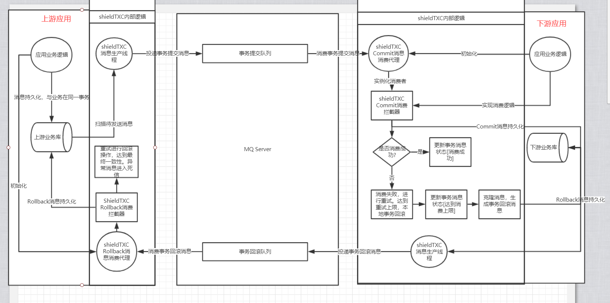

# shieldEventTxc

> 基于本地消息表及消息溯源机制的分布式事务框架，保证最终一致性

## 本地消息表方案简介

本地消息表方案源自ebay，传入国内后多次被大厂（如：支付宝）落地，经过布道被大家所熟知。它的核心机理分为事务发起方（我们称事务上游），事务联动方（我们称下游），二者为分布式系统内两组不同的应用，它们应当使用独立的数据源。

### 事务上游处理逻辑

事务上游，执行本地业务的同时，将消息持久化到业务数据源中，持久化流程与业务操作处于同一个事务中，保证了业务与消息同时成功持久化。

到这里，事务上游的业务就执行结束了，通过线程异步地轮询消息表，将待发送的消息投递到消息中间件的事务执行队列（我们将该队列的Topic称为事务执行Topic）中。投递成功则更新消息状态为 **[已投递]**。

### 事务下游处理逻辑

事务下游拉取消息进行消费，在业务消费之前，首先将消息持久化到本地，持久化成功后执行消费逻辑。

下游通过重试最大限度地保证业务消费逻辑执行成功，如果达到某个设定的消费次数阈值仍旧消费失败，那么我们认为事务下游没办法将事务处理成功，此时事务下游拷贝之前持久化的消息，标记为回滚状态消息，并投递到业务回滚队列（我们将该队列的Topic称为事务回滚Topic）中。投递成功则更新消息状态为 **[已投递]**。

事务上游需要实现回滚逻辑，接收到事务下游投递的回滚消息后，执行回滚逻辑，对业务进行回滚操作。该流程通过消费重试实现，如果达到最大消费次数仍旧不能回滚，则回滚消息会进入消息中间件的死信队列。此时需要人工干预，取出死信消息进行手工回滚操作，保证业务的正常运行。

一般而言，如果环境稳定，业务逻辑无严重bug，是不会出现一直重试都执行不完的情况，如果有，很大可能是代码逻辑有问题需要做进一步的排查。

## 本地消息表方案注意点

本地消息表方案依赖消息中间件，通过消息发送阶段的ACK判断消息是否被持久化，一旦返回消息投递成功，则通过消息中间件本身的配置即可保证该消息不会丢失；

通过消费阶段的重试加上业务系统的幂等保证事务下游与事务上游能够最大可能的达成最终一致。

如果还是存在异常，则需要人工干预，此处也能看出一点，技术方案往往都是折中产物，这也是最终一致性本身的特点，我们能够容忍一定时间的不一致状态，但是我们能够确保该不一致时间窗口之后，业务的上下游能够达成数据的一致性，建立在该前提下，我们才能够探讨分布式事务的柔性解决方案。

由于本地消息表方案依赖了消息中间件，因此我们需要保证消息中间件的高可靠，否则系统的可用性会因为引入第三方组件而下降。如：配置RocketMQ的多主多从集群模式，使用Kafka的多副本集群等，生产环境坚决不能出现单点风险。

除了消息中间件选型，我们还要保证消息持久化与本地事务要处于同一个事务域中。为什么要这么做呢？

> 本地消息表方案的使用，主要的目的是为了解决消息发送与事务提交不能保证同时成功同时失败，也就是消息发送本身与本地的事务并非是原子性的。

我们设想一个场景，某系统为了解决跨应用的分布式事务问题，因此引入了消息中间件，设想通过消息通讯作为上下游应用间的事务交互方式。即：上游处理业务完成后，发布一个普通消息到MQ的某Topic，下游订阅该Topic，对消息进行拉取并消费，完成下游业务。

那么这么做能够保证上下游数据的一致性吗？如果没有异常情况出现，当然是可以的，但是我们的系统是要有一定的容错能力的，当出现如下异常情况，上下游数据便不是一致的。

> 当上游进行业务处理完成后，提交了本地事务，接着进行消息发送时，上游系统宕机，当上游系统恢复后，消息也不会再发送了，那么上下游就会出现数据的不一致。

这个异常出现的原因就是没有保证消息发送与本地事务的原子性，解决方案就是引入本地消息表。

当引入本地消息表，在业务事务内将消息进行持久化，由于业务数据与消息数据处于同一事务，因此二者一定是同时成功同时失败，也就是原子的。当消息持久化后，通过异步线程扫表进行发送，如果出现系统宕机，在恢复之后，由于消息已经存在，因此能够将该持久化的消息扫描出来进行相应的投递操作。这就保证了本地事务执行成功后，消息一定能发送出去。这里可能会有疑问，万一消息发送失败呢？当然是继续进行重发了，直到发出去为止。

如果本地事务直接就执行失败了，那么消息也不会持久化，此时业务就是失败的，需要业务方进行重试，这种情况下是不存在数据不一致的情况的。

## 原理图

## TODO 
1. TAG支持
2. 查询待发送消息limit可配置